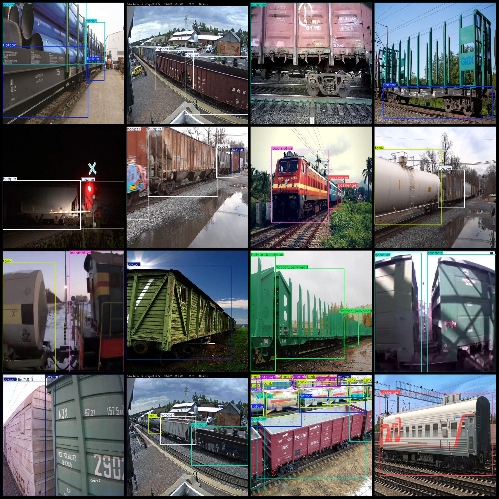
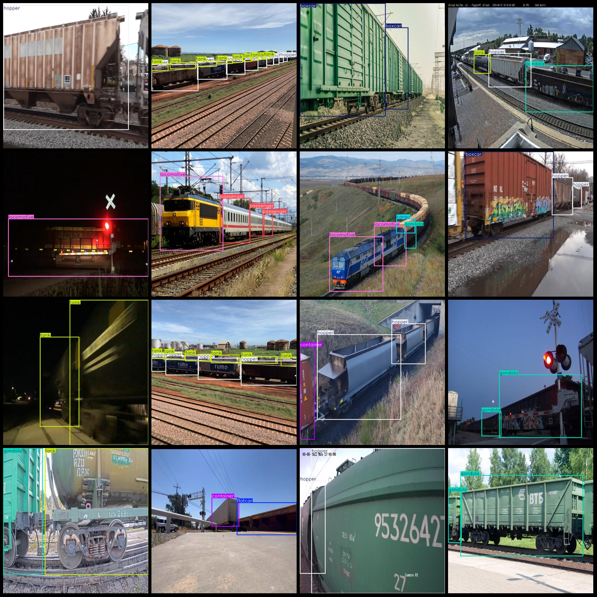

# Vision Detection Data Set for Intelligent Railways, 1311 images in VOC+YOLO format, 11 classes

Dataset format: Pascal VOC format + YOLO format (txt files without split path, only containing jpg images and corresponding VOC format xml files and yolo format txt files)
Number of images (jpg files): 1311
Number of labels (xml files): 1311
Number of labels (txt files): 1311
Number of label categories: 11
Label category names (note that the order of labels in the yolo format is not consistent with this, but according to the labels folder classes.txt): ["autorack", "boxcar", "cargo", "container", "flatcar", "flatcar_bulkhead", "gondola", "hopper", "locomotive", "passenger", "tank"]
Each category of labels:
- autorack (automobile carrier) = 76
- boxcar (barrel car) = 369
- cargo (freight car) = 128
- container (container flat car) = 331
- flatcar (flat car) = 312
- flatcar_bulkhead (bulkhead flat car) = 87
- gondola (open truck) = 469
- hopper (dump truck) = 488
markdown
The locomotive frame is a part of the locomotive that holds the wheels and allows them to turn. It is made up of several parts such as the bogie, the tender, and the cab. The frame also has various bolts and nuts that hold everything together.
The passenger (passenger) frames are 183.
Tank Frames = 634
Total Frames: 3338  
Image Resolution: 640x640  
Annotation Tool: labelImg  
Annotation Rules: Rectangular frames for categories  
Important Note: No guarantee is made regarding the accuracy of the trained models or weight files.  
Image Preview:
## Image

Here is a pay link on Stripe ( https://buy.stripe.com/3cs8yP7sY87d0vu9AB ). Please contact me lonlonago@foxmail.com after funding $89, and I will send you a complete data files , thank you!

